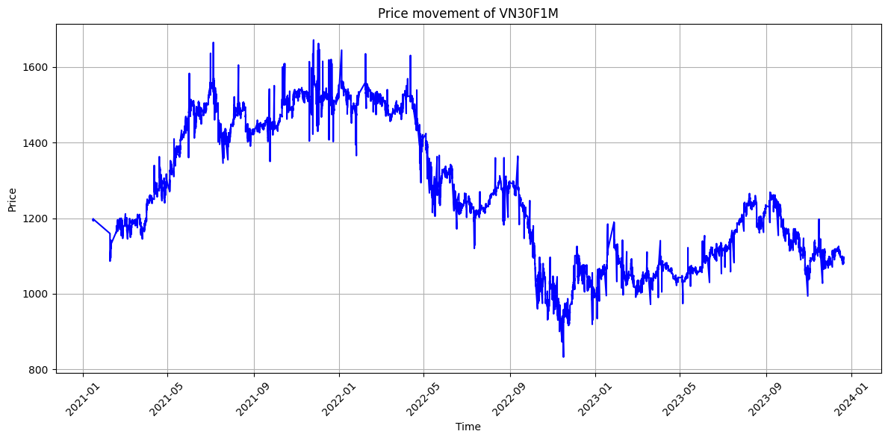
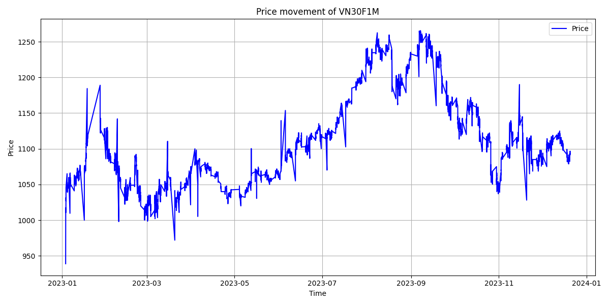

# Group 07

- Dương Phúc Nguyên - 21125124
- Nguyễn Huỳnh Việt Thống - 21125140

# Abstract

This project presents a trading strategy for **VN30 Index Futures (VN30F1M)** based on the phenomenon that price divergences from the 50-period simple moving average (SMA50) will revert to the mean, while strong breakouts with high volume will indicate momentum. The strategy blends both **mean-reversion** and **momentum-based** strategies using indicators such as SMA50, Bollinger Bands, and volume analysis. Positions are started with entry signals that correspond to price departures and confirmation breakouts with clearly defined stop-loss and take-profit conditions. The simulation results indicate that by employing both the strategies in combination, decision-making and returns are maximized under varying market conditions.

# Introduction

In the context of Vietnam's fast-growing financial market, VN30 Index Futures (VN30F1M) trading is not only a moneymaking prospect but also a money-draining risk due to its volatility and high liquidity. This project was motivated by the need to develop a rule-based trading strategy that can reliably capitalize on price trends, particularly **mean reversion** and **momentum breakout activity** observed across technical indicators like moving averages and Bollinger Bands.

To achieve this, we applied a **mean-reversion** and **momentum-based** hybrid trading strategy, experimented through extensive backtesting against historical market data. Our algorithm incorporates position sizing, take-profit and stop-loss rules, and performance metrics such as Sharpe ratio and maximum drawdown. The aim of the project is to identify and optimize trading parameters that yield stable and profitable results, thus helping algorithmic traders make informed decisions in the VN30F1M futures market.

# Trading algorithm process

## Trading Hypotheses

The working hypothesis for this project is that VN30F1M price action exhibits both mean-reverting and momentum breakout properties. That is, whenever prices drift far from the 50-period Simple Moving Average (SMA50), they will return to the mean. But if the price breaks out of a significant resistance or support level on high volume, it will persist in the breakout direction. These observations provided the foundation for the development of a dual-strategy system that employs both mean-reversion and momentum signals to determine trades.

## Data Collection and Processing

Historical market information for the VN30 Index Futures was directly retrieved from a PostgreSQL database containing minute-level trading data. The information contained price, volume, and symbol data for a few contract months. The data was resampled to 1-minute frequency and cleaned to remove missing values after being gathered. Technical indicators such as SMA20, SMA50, Bollinger Bands, resistance/support levels, and average volume were computed and saved in separate in-sample and out-of-sample CSV files utilizing the `helper.compute_indicators()` function.

## Trading Algorithm Implementation

The trading logic resides in the `strategy.py` file. It inspects the market condition for each time step and takes a long or short position if some entry conditions are met. Mean-reversion entries are placed when prices go significantly below/above SMA50 and Bollinger Bands. Momentum entries take place when prices break through support or resistance levels with greater than 1.5 times the 20-period average volume. All trades come with predefined profit-taking and stop-loss amounts. The simulation also tracks metrics like **balance, win rate, Sharpe ratio, and max drawdown.** The entire pipeline can be executed via the `main.py` interface, which provides menus for data prep, hyperparameter search, and backtesting.

## In-sample Backtesting

Backtesting was performed using in-sample 2021–2022 data in order to test the algorithm with known parameters. With default settings, we checked significant metrics such as cumulative return, trade statistics, and portfolio volatility. The outcome showed the peaks and troughs of the initial settings of the strategy and gave a point of reference for subsequent optimization. This ensured that hypothesis-based rules could generate trades with potential profitability in a well-known environment.

## Optimization

To improve performance, we used **Optuna**, which is a hyperparameter optimization library. The algorithm tuned five key parameters: **SMA window length, take-profit thresholds, and stop-loss thresholds for mean-reversion and momentum strategies.** The goal in each trial was to maximize the Sharpe ratio for the in-sample data. The best parameter set was saved to a JSON file `best_trial_result.json` and used for further testing. This enhanced risk-adjusted returns by a significant margin and helped tune the model to market dynamics.

## Out-of-sample Backtesting

After optimization, the trading strategy was backtested on out-of-sample 2023 data to test its ability to generalize. This out-of-sample test mimicked real-world deployment and ensured that the optimized parameters had the ability to perform outside of the training window. It was discovered that the model continued to produce a competitive Sharpe ratio and profitable trade results, confirming the robustness of the dual-strategy approach and the effectiveness of parameter tuning.

# Data

The data using in this project is tick data of VN30F1M from 2020-12-18 to 2023-12-21. After being collected from the Algotrade database, the data is aggregated to time interval of 1 minute.

## Data collection

- The tick price and quantity of VN30F1M are collected from Algotrade database using SQL queries.
- The file query.py contains the function to get the data and save the data to a csv file at the path <DATA_PATH>/data/data.csv

**Figure 1: Full Data Graph**



## Data processing

- The data will be aggregated into minute data. Then it will be splited into in_sample_data and out_sample_data. The in_sample_data will contain data from 2021 to 2022, and out_sample data will contain data in 2023.
- The in_sample_data and out_sample_data are stored in <DATA_PATH>/data/in_sample_data.csv and <DATA_PATH>/data/out_sample_data.csv

**Figure 2: In Sample Data Graph**


**Figure 3: Out Sample Data Graph**



# Implementation

**Requirements:** This implementation requires `pip` to work properly

## Clone project's repository

```bash
git clone https://github.com/algotrade-course/Group7.git
cd Group7
```

## Set up Python virtual environment

**1. Create the virtual environment**
```bash
python -m venv myenv 
```

**2. Activate the virtual environment**

- For Windows:
```bash
myenv\Scripts\activate
```

- For Linux/MacOS:
```bash
source myenv/bin/activate
```

## Start application

**1. Start the program**
```bash
python main.py
```

**2. Libraries**
If you do not have the requisite libraries needed for this application, it will ask you to install those libraries. Here is an example:
```
Missing the following required libraries: numpy, matplotlib, optuna, psycopg-binary, pandas

Would you like to install them? (y/n):
```
Enter `y` will automatically install all the required libraries and proceed to the main menu.

**3. The main menu**
- Enter `1` will initiate all the data needed for future simulation and optimization. This will include initiating the dataset, in sample data, out of sample data, and delete the currently saved optimized simulation values.
- Enter `2` will take the user to the Fine tune section.
- Enter `3` will take the user to the Backtesting section.
- Enter `4` to quit the program.
```
=== MAIN MENU ===
1. Initiate all data (recommended before finetuning and backtesting)
2. Run Finetuning
3. Run Backtesting
4. Quit
Choose an option (1-4):
```

# Results