# Group 07

- Dương Phúc Nguyên - 21125124
- Nguyễn Huỳnh Việt Thống - 21125140

# 0. Abstract

This project presents a trading strategy for **VN30 Index Futures (VN30F1M)** based on the phenomenon that price divergences from the 50-period simple moving average (SMA50) will revert to the mean, while strong breakouts with high volume will indicate momentum. The strategy blends both **mean-reversion** and **momentum-based** strategies using indicators such as SMA50, Bollinger Bands, and volume analysis. Positions are started with entry signals that correspond to price departures and confirmation breakouts with clearly defined stop-loss and take-profit conditions. The simulation results indicate that by employing both the strategies in combination, decision-making and returns are maximized under varying market conditions.

# 1. Introduction

In the context of Vietnam's fast-growing financial market, VN30 Index Futures (VN30F1M) trading is not only a moneymaking prospect but also a money-draining risk due to its volatility and high liquidity. This project was motivated by the need to develop a rule-based trading strategy that can reliably capitalize on price trends, particularly **mean reversion** and **momentum breakout activity** observed across technical indicators like moving averages and Bollinger Bands.

To achieve this, we applied a **mean-reversion** and **momentum-based** hybrid trading strategy, experimented through extensive backtesting against historical market data. Our algorithm incorporates position sizing, take-profit and stop-loss rules, and performance metrics such as Sharpe ratio and maximum drawdown. The aim of the project is to identify and optimize trading parameters that yield stable and profitable results, thus helping algorithmic traders make informed decisions in the VN30F1M futures market.

# 2. Trading Hypothesis

## Proposed Hypothesis

The working hypothesis for this project is that VN30F1M price action exhibits both mean-reverting and momentum breakout properties. That is, whenever prices drift far from the 50-period Simple Moving Average (SMA50), they will return to the mean. But if the price breaks out of a significant resistance or support level on high volume, it will persist in the breakout direction. These observations provided the foundation for the development of a dual-strategy system that employs both mean-reversion and momentum signals to determine trades.

In sumary, When the price deviates signicantly from the MA50 line, it tends to revert to the mean. However, if the price breaks above a key resistance level or below key support level with strong volume, it may indicate a continuation in the breakout direction.

## Trading Algorithm

- **Independent variable:** VN30F1M with at 1-minute intervals

- **Dependable variables:**
  
  - $SMA(50) = (P_t + P_{t-1} + ... + P_{t-49}) \div n$
  
  - Bollinger Bands (20, 2):
    
    - $Upper Band = SMA(20) + 2 × Standard Deviation(20)$
    
    - $Lower Band = SMA(20) - 2 × Standard Deviation(20)$

- **Entry conditions:**
  
  - **Mean reversion entry:**
    
    - If $P_t$ is lower than Lower Bollinger Band and $P_t$ is more than 2% below SMA(n), open a long position.
    
    - If P_t is higher than Upper Bollinger Band and P_t is more than 2% above SMA(n), open a short position.
  
  - **Momentum entry (Breakout confirmation):**
    
    - $\text{Key resistance level = max}(P_t, P_{t-1},...,P_{t-29})$
    
    - $\text{Key support level = min}(P_t, P_{t-1},...,P_{t-29})$
    
    - Average volume (20): The average volume over the past 20 periods.
    
    - If $P_t>$ Key resistance level with $V_t>1.5 \ \cdot \ $Average Volume (20), open a long position.
    
    - If $P_t<$ Key support level with $V_t>1.5 \ \cdot \ $ Average Volume (20), open a short position.

- **Trade size:** 1 contract per position.

# 3. Data

Historical market information for the **VN30 Index Futures** was directly retrieved from a Google Drive link containing tick-level trading data. The information contained price, volume, and symbol data for a few contract months. The data was resampled to 1-minute frequency and cleaned to remove missing values after being gathered. Technical indicators such as SMA20, SMA50, Bollinger Bands, resistance/support levels, and average volume were computed and saved in separate in-sample and out-of-sample CSV files utilizing the `helper.compute_indicators()` function.

## Data collection

- The tick price and quantity of **VN30F1M** are collected from a private database using SQL queries, then was uploaded to a public Google Drive link.

- The file `query.py` contains the function to download the data from the Google Drive link and save it to a csv file at the path `<DATA_PATH>/data/data.csv`

**Figure 1: Full Data Graph**


## Data processing

- The data will be aggregated into minute data. Then it will be splited into in_sample_data and out_sample_data. The in_sample_data will contain data from 2021 to 2022, and out_sample data will contain data in 2023.

- The in_sample_data and out_sample_data are stored in `<DATA_PATH>/data/in_sample_data.csv` and `<DATA_PATH>/data/out_sample_data.csv`

**Figure 2: In Sample Data Graph**


**Figure 3: Out Sample Data Graph**


# 4. Implementation

The trading logic resides in the `strategy.py` file. It inspects the market condition for each time step and takes a long or short position if some entry conditions are met. Mean-reversion entries are placed when prices go significantly below/above SMA50 and Bollinger Bands. Momentum entries take place when prices break through support or resistance levels with greater than 1.5 times the 20-period average volume. All trades come with predefined profit-taking and stop-loss amounts. The simulation also tracks metrics like **balance, win rate, Sharpe ratio, and max drawdown.** The entire pipeline can be executed via the `main.py` interface, which provides menus for data prep, hyperparameter search, and backtesting.

## Components

This algorithm is part of a downloadable GitHub repository project that can be executed directly from the terminal. The implementation is modular, organized into 8 separate components, each contained within its own `.py` file for clarity and maintainability. This project consists of:

- `main.py`: Main executable file with the program’s menu and library installation setup.

- `data_prep.py`: Loads and formats data, splits it into in-sample/out-of-sample sets, and resets optimized values.

- `query.py`: Handles data retrieval from the database (Google Drive).

- `strategy.py`: Implements the core trading algorithm logic.

- `evaluator.py`: Contains evaluation metrics like Sharpe ratio, max drawdown, and drawdown over time.

- `helper.py`: Utility functions for plotting, SMA, Bollinger Bands, average volume, and more.

- `backtesting.py`: Performs both in-sample and out-of-sample backtesting.

- `finetuning.py`: Optimizes algorithm parameters using Optima for best results.

## Program Setup

**Requirements:** This implementation requires `pip` to work properly

#### Step 1: Clone project's repository

```bash
git clone https://github.com/algotrade-course/Group7.git
cd Group7
```

#### Step 2: Set up Python virtual environment

**1. Create the virtual environment**

```bash
python -m venv myenv
```

**2. Activate the virtual environment**

- For Windows:

```bash
myenv\Scripts\activate
```

- For Linux/MacOS:

```bash
source myenv/bin/activate
```

#### Step 3: Start program

**1. Start the program**

```bash
python main.py
```

**2. Libraries** If you do not have the requisite libraries needed for this application, it will ask you to install those libraries. Here is an example:

```
Missing the following required libraries: numpy, matplotlib, optuna, psycopg-binary, pandas

Would you like to install them? (y/n):
```

Enter `y` will automatically install all the required libraries and proceed to the main menu.

**3. Menu Interface:** Enter the number of each option to execute it:

```
=== MAIN MENU ===
1. Initiate all data (recommended before finetuning and backtesting)
2. Run Finetuning
3. Run Backtesting
4. Quit
Choose an option (1-4):
```

## Data Collection

After choosing `Initiate all data` option in the Main Menu, the program will:

- Pull data (`data.csv`) from [Google Drive](https://drive.google.com/uc?id=1BU9X7Ipxa4BjMNG5wRC53XcuspfxHnBf) and put them in **Data** folder (the program will create the folder if it is not existed yet), and then the data will be format into 1-minute intervals and split into `in_sample_data.csv` and `out_sample_data.csv`. The folder structure is as follows:

```
Data 
├── Data.csv
├── in_sample_data.csv
├── out_sample_data.csv
```

`Initiate all data` will also reset all the values that will later be optimized back to predetermined values as follows:

```
# Original values
{
    "value": null,
    "params": {
        "sma_window": 50,
        "tp_mean_rev": 5,
        "tp_momentum": 10,
        "sl_mean_rev": 5,
        "sl_momentum": 4
    }
}
```

There are 2 files holding these sets of values. `original_params.json` will always hold original values, while `best_trial_result.json` will only hold original values when all data is reset, and will later be replaced with optimized data via optimization.

## Fine Tuning

Choosing `Run Finetuning` option in the Main Menu will take the user to the Fine Tuning menu:

```
=== Optuna Fine-Tuning Menu ===
1. Run fine-tuning
2. Show dot plot of trials
3. Back to main menu
Enter your choice: 
```

The Fine-tuning Menu lets the user choose between executing the fine-tuning process (which will be discussed further in a later section) and plotting a dot graph comparing the values of each trial taken. Note that option `2.` can only be executed after the user has run an optimization section in this run of the program.

## Backtesting

Choosing `Run Backtesting` option in the Main Menu will take the user to the Backtesting menu:

```
--- Select Sample Type ---
1. In-sample testing
2. Out-of-sample testing
3. Back to main menu
4. Quit
```

Both In-sample and Out-of-sample data can be tested with both original and the latest optimized values. In addition, user can view graph showing difference in **Net Asset Value Over Time** between original and optimized parameters:

- In-sample Testing menu:

```
--- Backtesting Menu (data/in_sample_data.csv) ---
1. Execute on the original parameters
2. Execute on the optimized parameters
3. plot the different of original vs optimized backtesting
4. Go back
5. Quit
```

- Out-of-sample Testing menu:

```
--- Backtesting Menu (data/out_sample_data.csv) ---
1. Execute on the original parameters
2. Execute on the optimized parameters
3. plot the different of original vs optimized backtesting
4. Go back
5. Quit
```


# 5. In-sample Backtesting

Backtesting was performed using in-sample 2021–2022 data in order to test the algorithm with known parameters. With default settings, we checked significant metrics such as cumulative return, trade statistics, and portfolio volatility. The outcome showed the peaks and troughs of the initial settings of the strategy and gave a point of reference for subsequent optimization. This ensured that hypothesis-based rules could generate trades with potential profitability in a well-known environment.

# 6. Optimization

To improve performance, we used **Optuna**, which is a hyperparameter optimization library. The algorithm tuned five key parameters: **SMA window length, take-profit thresholds, and stop-loss thresholds for mean-reversion and momentum strategies.** The goal in each trial was to maximize the Sharpe ratio for the in-sample data. The best parameter set was saved to a JSON file `best_trial_result.json` and used for further testing. This enhanced risk-adjusted returns by a significant margin and helped tune the model to market dynamics.

# 7. Out-of-sample Backtesting

After optimization, the trading strategy was backtested on out-of-sample 2023 data to test its ability to generalize. This out-of-sample test mimicked real-world deployment and ensured that the optimized parameters had the ability to perform outside of the training window. It was discovered that the model continued to produce a competitive Sharpe ratio and profitable trade results, confirming the robustness of the dual-strategy approach and the effectiveness of parameter tuning.

# 8. Results

## Data collection

- The tick price and quantity of VN30F1M are collected from a private database using SQL queries, then was uploaded to a public Google Drive link.
- The file query.py contains the function to download the data from the Google Drive link and save it to a csv file at the path <DATA_PATH>/data/data.csv

**Figure 1: Full Data Graph**


## Data processing

- The data will be aggregated into minute data. Then it will be splited into in_sample_data and out_sample_data. The in_sample_data will contain data from 2021 to 2022, and out_sample data will contain data in 2023.
- The in_sample_data and out_sample_data are stored in <DATA_PATH>/data/in_sample_data.csv and <DATA_PATH>/data/out_sample_data.csv

**Figure 2: In Sample Data Graph**


**Figure 3: Out Sample Data Graph**


## Testing

The default parameters are as follows:

```
{
    "value": null,
    "params": {
        "sma_window": 50,
        "tp_mean_rev": 5,
        "tp_momentum": 10,
        "sl_mean_rev": 5,
        "sl_momentum": 4
    }
}
```

### In sample backtesting

The testing result with default parameters and the initial balance of 40,000,000VND:

```
Initial Balance: 40000000.0
Final Balance: 341921999.99999994
Win Rate: 83.33333333333334
Total Trades: 144
Winning Trades: 120
Losing Trades: 24
Accumulated Return: 7.548049999999998
Sharpe Ratio: 0.013550733578558087
Annualized Sharpe Ratio: 3.5205838556838356
Max Drawdown: -0.1457418178661343
```

**Figure 4: The PnL value over time**

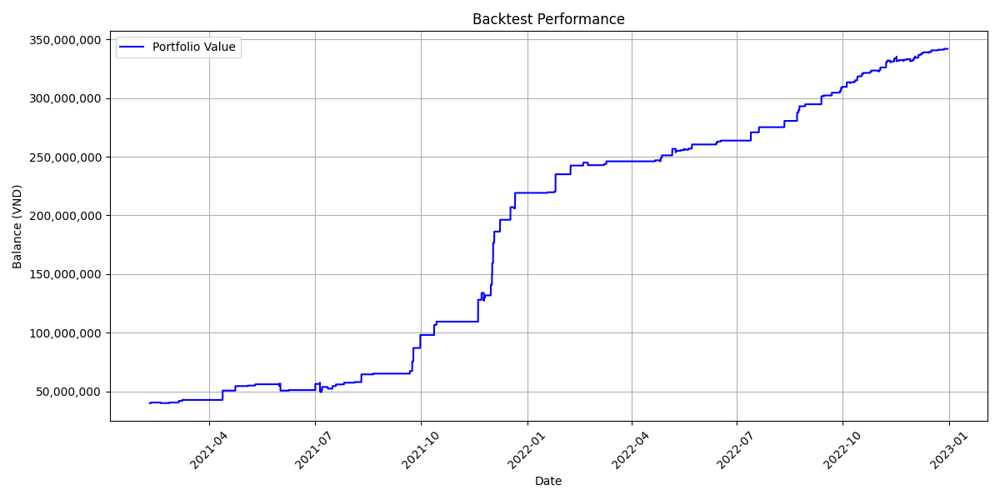

**Figure 5: The Drawdown value over time**

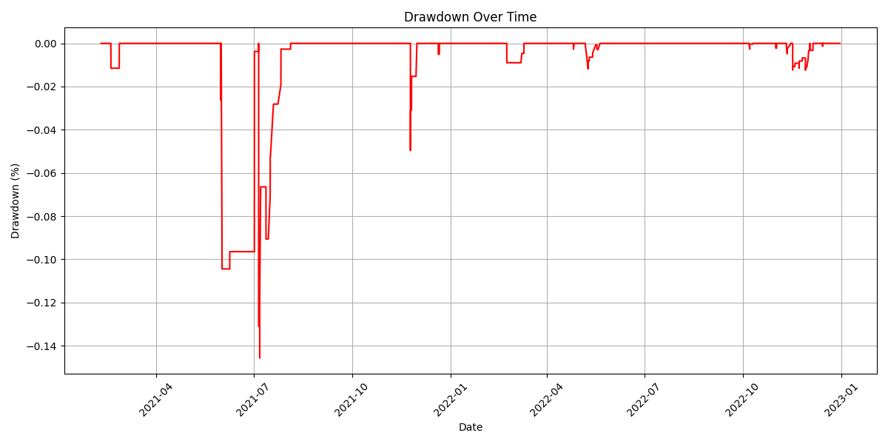

**Figure 6: The Distribution of standardized minute returns (Z-Score)**

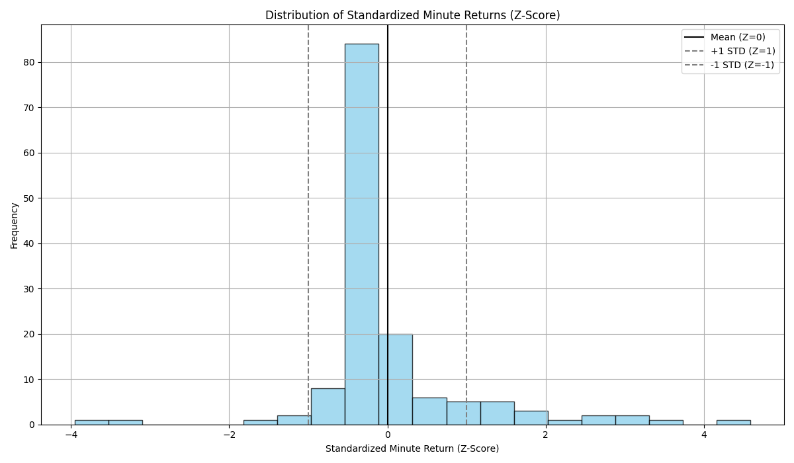

### Out sample backtesting

The testing result with default parameters and the initial balance of 40,000,000VND:

```
Initial Balance: 40000000.0
Final Balance: 105258000.00000004
Win Rate: 93.47826086956522
Total Trades: 46
Winning Trades: 43
Losing Trades: 3
Accumulated Return: 1.631450000000001
Sharpe Ratio: 0.019119642119491697
Annualized Sharpe Ratio: 4.9674287360240275
Max Drawdown: -0.015752822662429847
```

**Figure 7: The PnL value over time**

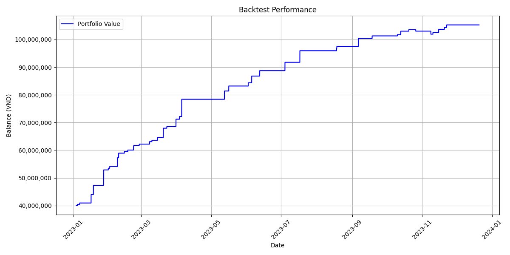

**Figure 8: The Drawdown value over time**

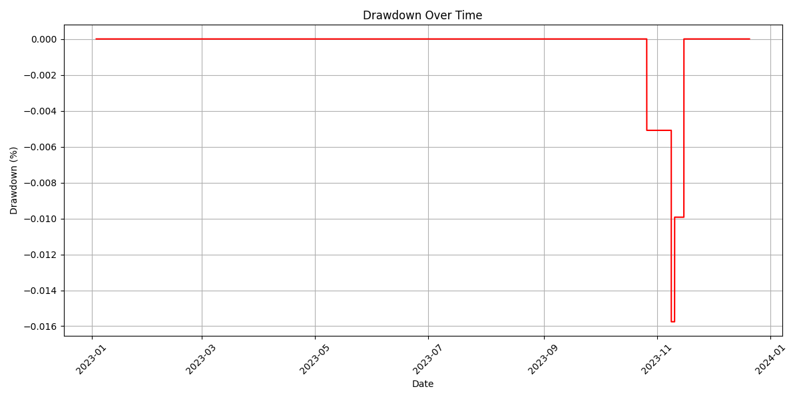

**Figure 9: The Distribution of standardized minute returns (Z-Score)**

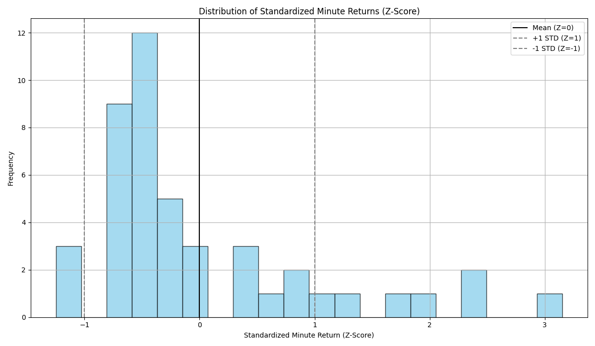

## Finetuning

After using in-sample data on finetuning with 100 trial and the initial balance of 40,000,000VND, the optimized parameters are:

```
{
    "value": 0.014838635780793847,
    "params": {
        "sma_window": 64,
        "tp_mean_rev": 10.0,
        "tp_momentum": 12.0,
        "sl_mean_rev": 6.5,
        "sl_momentum": 7.5
    }
}
```

**Figure 10: The Optuna trials**

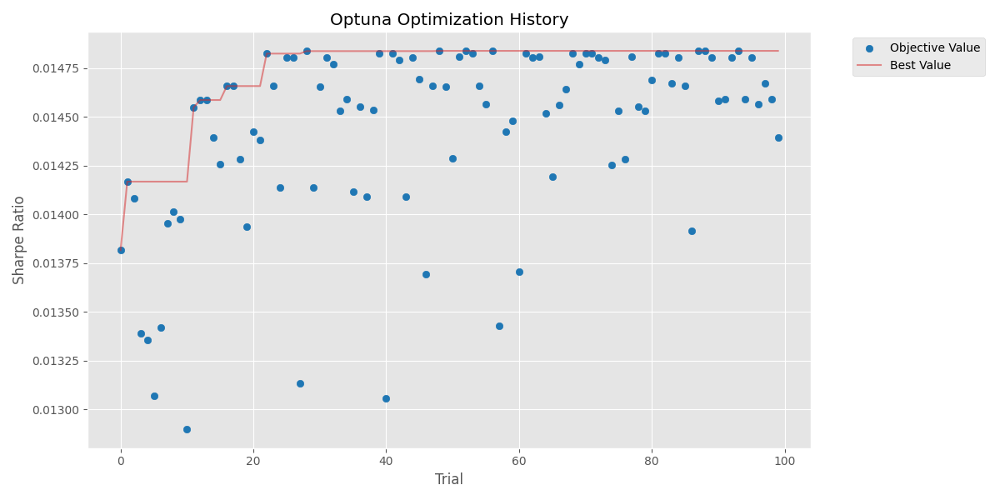

**Figure 11: The PnL value over time different on in sample data**

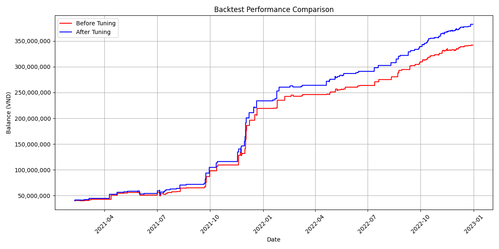

**Figure 12: The PnL value over time different on out sample data**

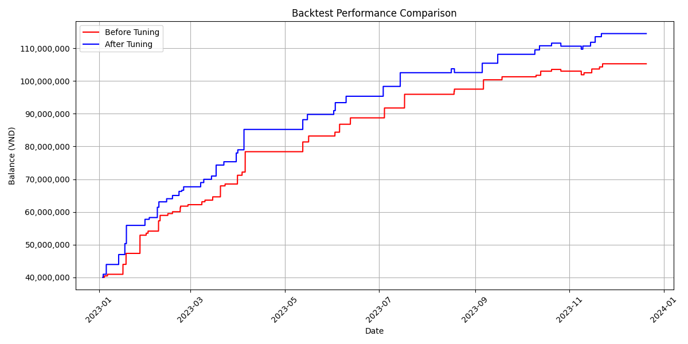

**Figure 13: The Drawdown value over time with optimized parameters on in sample data**

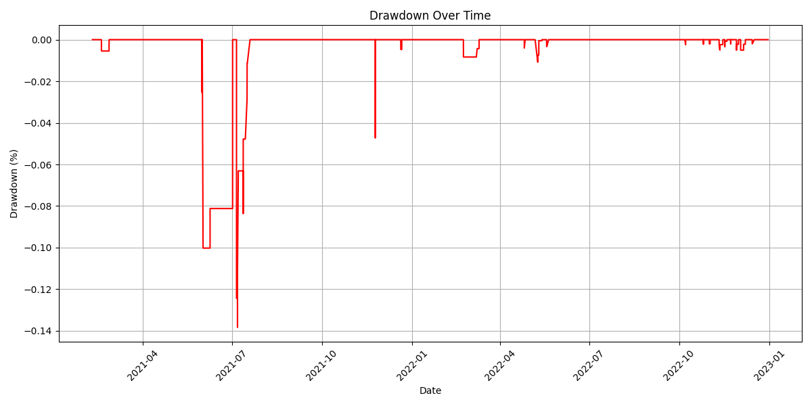

**Figure 14: The Drawdown value over time with optimized parameters on out sample data**

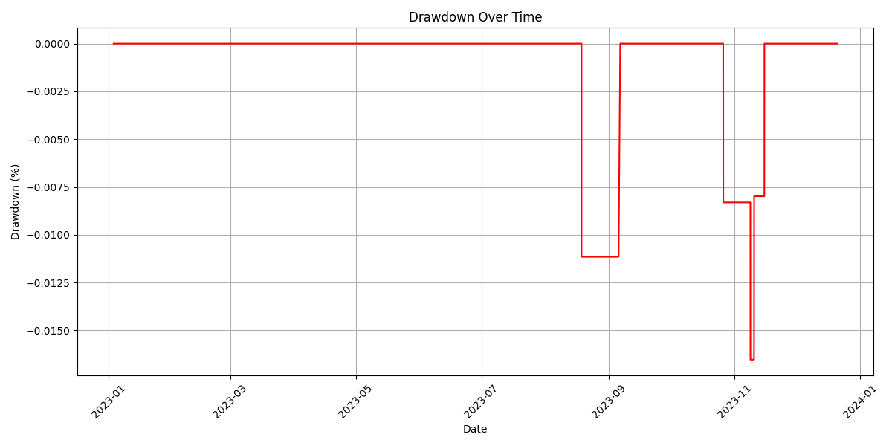

**Figure 15: The Distribution of standardized minute returns (Z-Score) with optimized parameters on in sample data**

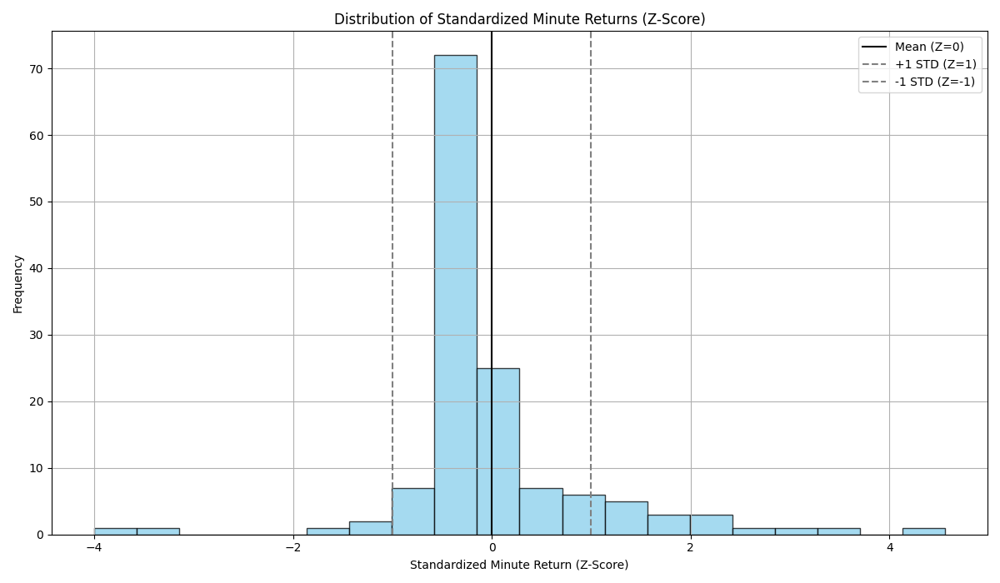

**Figure 16: The Distribution of standardized minute returns (Z-Score) with optimized parameters on out sample data**

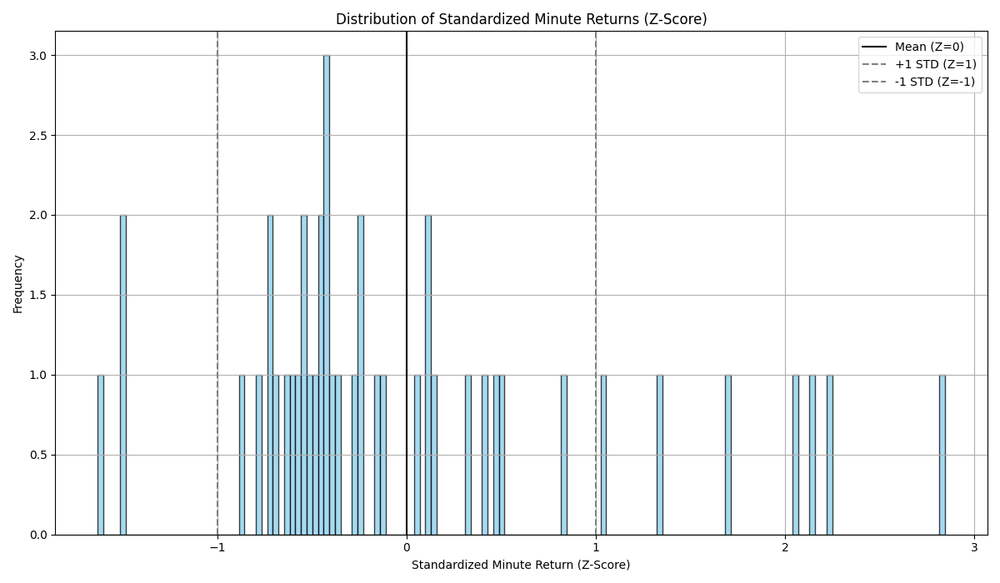
