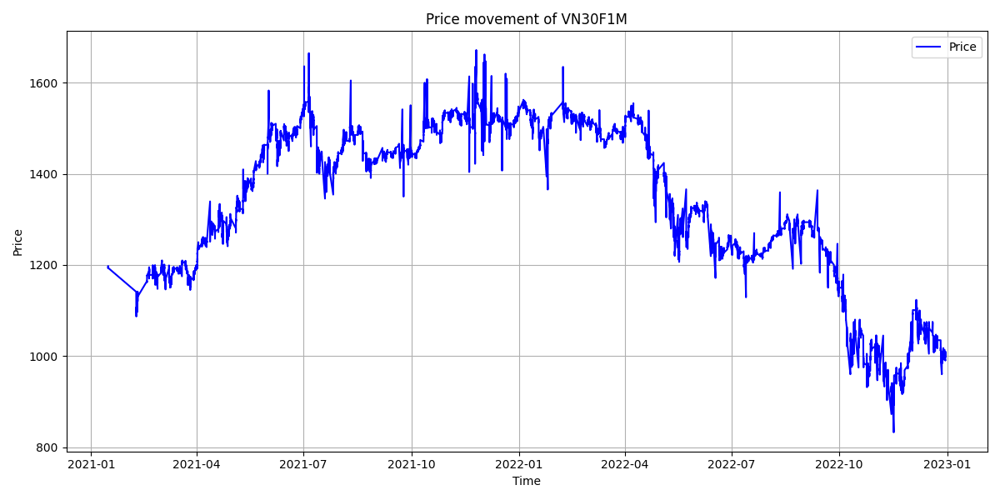

# Group7

# Data

The data using in this project is tick data of VN30F1M from 2020-12-18 to 2023-12-21. After being collected from the Algotrade database, the data is aggregated to time interval of 1 minute.

## Data collection

- The tick price and quantity of VN30F1M are collected from Algotrade database using SQL queries.
- The file query.py contains the function to get the data and save the data to a csv file at the path <DATA_PATH>/data/data.csv

<figure>
  
  <figcaption>Full Data Graph</figcaption>
</figure>

## Data processing

- The data will be aggregated into minute data. Then it will be splited into in_sample_data and out_sample_data. The in_sample_data will contain data from 2021 to 2022, and out_sample data will contain data in 2023.
- The in_sample_data and out_sample_data are stored in <DATA_PATH>/data/in_sample_data.csv and <DATA_PATH>/data/out_sample_data.csv

<figure>
  
  <figcaption>In Sample Data Graph</figcaption>
</figure>

<figure>
  
  <figcaption>Out Sample Data Graph</figcaption>
</figure>
