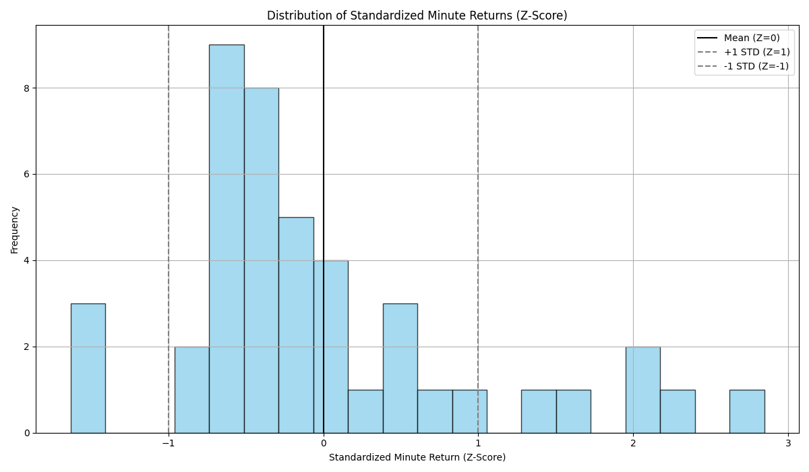

# Group 07

- Dương Phúc Nguyên - 21125124
- Nguyễn Huỳnh Việt Thống - 21125140
- Nguyễn Hữu Hào - 21125160

# 0. Abstract

This project presents a trading strategy for **VN30 Index Futures (VN30F1M)** based on the phenomenon that price divergences from the 50-period simple moving average (SMA50) will revert to the mean, while strong breakouts with high volume will indicate momentum. The strategy blends both **mean-reversion** and **momentum-based** strategies using indicators such as SMA50, Bollinger Bands, and volume analysis. Positions are started with entry signals that correspond to price departures and confirmation breakouts with clearly defined stop-loss and take-profit conditions. The simulation results indicate that by employing both the strategies in combination, decision-making and returns are maximized under varying market conditions.

# 1. Introduction

In the context of Vietnam's fast-growing financial market, VN30 Index Futures (VN30F1M) trading is not only a moneymaking prospect but also a money-draining risk due to its volatility and high liquidity. This project was motivated by the need to develop a rule-based trading strategy that can reliably capitalize on price trends, particularly **mean reversion** and **momentum breakout activity** observed across technical indicators like moving averages and Bollinger Bands.

To achieve this, we applied a **mean-reversion** and **momentum-based** hybrid trading strategy, experimented through extensive backtesting against historical market data. Our algorithm incorporates position sizing, take-profit and stop-loss rules, and performance metrics such as Sharpe ratio and maximum drawdown. The aim of the project is to identify and optimize trading parameters that yield stable and profitable results, thus helping algorithmic traders make informed decisions in the VN30F1M futures market.

# 2. Trading Hypothesis

## Proposed Hypothesis

The working hypothesis for this project is that VN30F1M price action exhibits both mean-reverting and momentum breakout properties. That is, whenever prices drift far from the 50-period Simple Moving Average (SMA50), they will return to the mean. But if the price breaks out of a significant resistance or support level on high volume, it will persist in the breakout direction. These observations provided the foundation for the development of a dual-strategy system that employs both mean-reversion and momentum signals to determine trades.

In sumary, When the price deviates signicantly from the MA50 line, it tends to revert to the mean. However, if the price breaks above a key resistance level or below key support level with strong volume, it may indicate a continuation in the breakout direction.

## Trading Algorithm

- **Independent variable:** VN30F1M with at 1-minute intervals

- **Dependable variables:**
  
  - $SMA(50) = (P_t + P_{t-1} + ... + P_{t-49}) \div n$
  
  - Bollinger Bands (20, 2):
    
    - $Upper Band = SMA(20) + 2 × Standard Deviation(20)$
    
    - $Lower Band = SMA(20) - 2 × Standard Deviation(20)$

- **Entry conditions:**
  
  - **Mean reversion entry:**
    
    - If $P_t$ is lower than Lower Bollinger Band and $P_t$ is more than 2% below SMA(n), open a long position.
    
    - If $P_t$ is higher than Upper Bollinger Band and $P_t$ is more than 2% above SMA(n), open a short position.
  
  - **Momentum entry (Breakout confirmation):**
    
    - $\text{Key resistance level = max}(P_t, P_{t-1},...,P_{t-29})$
    
    - $\text{Key support level = min}(P_t, P_{t-1},...,P_{t-29})$
    
    - Average volume (20): The average volume over the past 20 periods.
    
    - If $P_t>$ Key resistance level with $V_t>$ 1.5 $\cdot$ Average Volume (20), open a long position.
    
    - If $P_t<$ Key support level with $V_t>$ 1.5 $\cdot$ Average Volume (20), open a short position.

- **Take Profit:**
  
  - Close the Mean Reversion position when the price reverts to SMA(50) or achieves a profit of 5 points.
  
  - Close the Momentum position when the price moves 10 points in the breakout direction.

- **Stop Loss:**
  
  - Close the Mean Reversion position if the price moves 5 points further away from SMA(50).
  
  - Close the Momentum position if the breakout fails and price returns to its previous range (stop loss at -4 points).

- **End-of-day Close:**
  
  - No positions remain overnight.
  
  - If there are open positions at the ATC (At-the-Close) session, close them using an ATC order.

- **Trade size:** 1 contract per position.

# 3. Data

Historical market information for the **VN30 Index Futures** was directly retrieved from a Google Drive link containing tick-level trading data. The information contained price, volume, and symbol data for a few contract months. The data was resampled to 1-minute frequency and cleaned to remove missing values after being gathered. Technical indicators such as SMA20, SMA50, Bollinger Bands, resistance/support levels, and average volume were computed and saved in separate in-sample and out-of-sample CSV files utilizing the `helper.compute_indicators()` function.

## Data collection

- The tick price and quantity of **VN30F1M** are collected from a private database using SQL queries, then was uploaded to a public Google Drive link.

- The file `query.py` contains the function to download the data from the Google Drive link and save it to a csv file at the path `<DATA_PATH>/data/data.csv`

**Figure 1: Full Data Graph**


## Data processing

- The data will be aggregated into minute data. Then it will be splited into in_sample_data and out_sample_data. The in_sample_data will contain data from 2021 to 2022, and out_sample data will contain data in 2023.

- The in_sample_data and out_sample_data are stored in `<DATA_PATH>/data/in_sample_data.csv` and `<DATA_PATH>/data/out_sample_data.csv`

**Figure 2: In Sample Data Graph**


**Figure 3: Out Sample Data Graph**


# 4. Implementation

The trading logic resides in the `strategy.py` file. It inspects the market condition for each time step and takes a long or short position if some entry conditions are met. Mean-reversion entries are placed when prices go significantly below/above SMA50 and Bollinger Bands. Momentum entries take place when prices break through support or resistance levels with greater than 1.5 times the 20-period average volume. All trades come with predefined profit-taking and stop-loss amounts. The simulation also tracks metrics like **balance, win rate, Sharpe ratio, and max drawdown.** The entire pipeline can be executed via the `main.py` interface, which provides menus for data prep, hyperparameter search, and backtesting.

## Components

This algorithm is part of a downloadable GitHub repository project that can be executed directly from the terminal. The implementation is modular, organized into 8 separate components, each contained within its own `.py` file for clarity and maintainability. This project consists of:

- `main.py`: Main executable file with the program’s menu and library installation setup.

- `data_prep.py`: Loads and formats data, splits it into in-sample/out-of-sample sets, and resets optimized values.

- `query.py`: Handles data retrieval from the database (Google Drive).

- `strategy.py`: Implements the core trading algorithm logic.

- `evaluator.py`: Contains evaluation metrics like Sharpe ratio, max drawdown, and drawdown over time.

- `helper.py`: Utility functions for plotting, SMA, Bollinger Bands, average volume, and more.

- `backtesting.py`: Performs both in-sample and out-of-sample backtesting.

- `finetuning.py`: Optimizes algorithm parameters using Optima for best results.

## Program Setup

**Requirements:** This implementation requires `pip` to work properly.

### Step 1: Clone project's repository

```bash
git clone https://github.com/algotrade-course/Group7.git
cd Group7
```

### Step 2: Set up Python virtual environment

**1. Create the virtual environment**

```bash
python -m venv myenv
```

**2. Activate the virtual environment**

- For Windows, there are 2 methods:
  
  - When using **Command Prompt (CMD)**:
    
    ```
    .\myenv\Scripts\activate.bat
    ```
  
  - When using **PowerShell**:
    
    ```
    .\myenv\Scripts\Activate.ps1
    ```

- For Linux/MacOS:

```bash
source myenv/bin/activate
```

### Step 3: Start program

**1. Start the program**

```bash
python main.py
```

**2. Libraries** If you do not have the requisite libraries needed for this application, it will ask you to install those libraries. Here is an example:

```
Missing the following required libraries: numpy, matplotlib, optuna, psycopg-binary, pandas

Would you like to install them? (y/n):
```

Enter `y` will automatically install all the required libraries and proceed to the main menu.

**3. Menu Interface:** Enter the number of each option to execute it:

```
=== MAIN MENU ===
1. Initiate all data (recommended before finetuning and backtesting)
2. Run Finetuning
3. Run Backtesting
4. Quit
Enter your choice (1-4): 
```

## Data Collection

After choosing `Initiate all data` option in the Main Menu, the program will:

- Pull data (`data.csv`) from [Google Drive](https://drive.google.com/uc?id=1BU9X7Ipxa4BjMNG5wRC53XcuspfxHnBf) and put them in **Data** folder (the program will create the folder if it is not existed yet), and then the data will be format into 1-minute intervals and split into `in_sample_data.csv` and `out_sample_data.csv`. The folder structure is as follows:

```
Data 
├── Data.csv
├── in_sample_data.csv
├── out_sample_data.csv
```

`Initiate all data` will also reset all the values that will later be optimized back to predetermined values as follows:

```
# Original values
{
    "value": null,
    "params": {
        "sma_window": 50,
        "tp_mean_rev": 5,
        "tp_momentum": 10,
        "sl_mean_rev": 5,
        "sl_momentum": 4
    }
}
```

There are 2 files holding these sets of values. `original_params.json` will always hold original values, while `best_trial_result.json` will only hold original values when all data is reset, and will later be replaced with optimized data via optimization.

## Fine Tuning

Choosing `Run Finetuning` option in the Main Menu will take the user to the Fine Tuning menu:

```
=== Optuna Fine-Tuning Menu ===
1. Run fine-tuning
2. Show dot plot of trials
3. Back to main menu
Enter your choice (1-3): 
```

The Fine-tuning Menu lets the user choose between executing the fine-tuning process (which will be discussed further in a later section) and plotting a dot graph comparing the values of each trial taken. Note that option `2.` can only be executed after the user has run an optimization section in this run of the program.

## Backtesting

Choosing `Run Backtesting` option in the Main Menu will take the user to the Backtesting menu:

```
--- Select Sample Type ---
1. In-sample testing
2. Out-of-sample testing
3. Back to main menu
4. Quit
Enter your choice (1-4): 
```

Both In-sample and Out-of-sample data can be tested with both original and the latest optimized values. In addition, user can view graph showing difference in **Net Asset Value Over Time** between original and optimized parameters:

- In-sample Testing menu:

```
--- Backtesting Menu (data/in_sample_data.csv) ---
1. Execute on the original parameters
2. Execute on the optimized parameters
3. plot the different of original vs optimized backtesting
4. Go back
5. Quit
Enter your choice (1-5): 
```

- Out-of-sample Testing menu:

```
--- Backtesting Menu (data/out_sample_data.csv) ---
1. Execute on the original parameters
2. Execute on the optimized parameters
3. plot the different of original vs optimized backtesting
4. Go back
5. Quit
Enter your choice (1-5): 
```

Backtesting will require the user to enter an initial balance in VND. After the backtest process, user can review the result of the algorithm via a variety of graph options:

```
1. View the Net Asset Value (NAV) over time graph
2. View the Drawdown over time graph
3. View standardized minutely returns distribution
4. Go back
5. Quit
Enter your choice (1-5): 
```

# 5. In-sample Backtesting

Backtesting was performed using in-sample 2021–2022 data in order to test the algorithm with known parameters. With default settings, we checked significant metrics such as cumulative return, trade statistics, and portfolio volatility. The outcome showed the peaks and troughs of the initial settings of the strategy and gave a point of reference for subsequent optimization. This ensured that hypothesis-based rules could generate trades with potential profitability in a well-known environment.

## Parameters

| Parameters                         | Value        | Status             | Description                                                        |
| ---------------------------------- | ------------ | ------------------ | ------------------------------------------------------------------ |
| `SMA_WINDOW_LENGTH`                | 50           | fixed, optimizable | Lookback period for calculating the Simple Moving Average.         |
| `TAKE_PROFIT_THRES_MEAN_REVERSION` | 5            | fixed, optimizable | Profit threshold for exiting mean reversion trades.                |
| `TAKE_PROFIT_THRES_MOMENTUM`       | 10           | fixed, optimizable | Profit threshold for exiting momentum-based trades.                |
| `CUT_LOSS_THRES_MEAN_REVERSION`    | 5            | fixed, optimizable | Stop-loss threshold for mean reversion strategy.                   |
| `CUT_LOSS_THRES_MOMENTUM`          | 4            | fixed, optimizable | Stop-loss threshold for momentum strategy.                         |
| `initial_balance`                  | (customized) | customizable       | Starting capital for the backtest or simulation.                   |
| `BB_BOUND`                         | 0.02         | fixed              | Threshold distance from Bollinger Bands used in trading decisions. |
| `VOLUME`                           | 1.5          | fixed              | Trade volume (in standardized units).                              |
| `margin ratio`                     | 0.175        | fixed              | Margin requirement ratio for leveraged trading.                    |
| `ar_ratio`                         | 0.8          | fixed              | Asset ratio for risk or capital distribution.                      |
| `multiplier`                       | 100000       | fixed              | Multiplier to convert points into VND                              |
| `point_fee`                        | 0.47         | fixed              | Fee charged per point or trade unit.                               |

## Decision Making

The algorithm operates on a bar-by-bar basis, using a sliding window defined by `SMA_WINDOW_LENGTH` to calculate technical indicators such as **Simple Moving Average (SMA)** and **Bollinger Bands**. It opens positions based on several conditions:

- **Mean Reversion Entry**: A long position is opened when price falls below the lower Bollinger Band and is significantly under the SMA. A short position is triggered when price rises above the upper Bollinger Band and is well above the SMA.

- **Momentum Entry**: A long position is opened when price breaks above resistance accompanied by strong volume. A short position is opened when price drops below support with high volume.

Once a position is entered, the strategy continuously monitors the price to determine an appropriate exit. Exits are triggered by one of the following:

- Profit reaching pre-defined thresholds (`TAKE_PROFIT_THRES_MEAN_REVERSION`, `TAKE_PROFIT_THRES_MOMENTUM`)

- Loss exceeding cut-loss thresholds (`CUT_LOSS_THRES_MEAN_REVERSION`, `CUT_LOSS_THRES_MOMENTUM`)

- Margin call-like condition: balance dropping below 10% of required margin deposit

## Evaluation metrics

- **Main evaluation metrics:**

| Metrics                 | Description                                           | Output Type |
| ----------------------- | ----------------------------------------------------- | ----------- |
| Final Balance           | The finalized capital after all trades                | Float Value |
| Accumulated Return      | Overall percentage gain/loss from the initial balance | Float Value |
| Sharpe Ratio            | Risk-adjusted return over the simulation period       | Float Value |
| Annualized Sharpe Ratio | Scaled Sharpe to reflect expected yearly performance  | Float Value |
| Maximum Drawdown (MDD)  | Largest peak-to-trough drop, indicating risk exposure | Float Value |
| NAV Over Time           | Net Asset Value over the in-sample time range         | Line Graph  |
| Drawdown Over Time      | Drawdown value over the in-sample time range          | Line Graph  |

- **Extra values:**
  
  - Total trades executed (`int`)
  
  - Number of win and loss trades (`int`)
  
  - Profit/Loss per trades (`int`)

## In-sample Backtesting Results

The testing result with default parameters with the initial balance of 40,000,000 (VND):

```
Initial Balance: 40000000.0
Final Balance: 341921999.99999994
Win Rate: 83.33333333333334
Total Trades: 144
Winning Trades: 120
Losing Trades: 24
Accumulated Return: 7.548049999999998
Sharpe Ratio: 0.013550733578558087
Annualized Sharpe Ratio: 3.5205838556838356
Max Drawdown: -0.1457418178661343
```

**Figure 4: The PnL value over time**


**Figure 5: The Drawdown value over time**


**Figure 6: The Distribution of standardized minute returns (Z-Score)**


# 6. Optimization

To improve performance, we used **Optuna**, which is a hyperparameter optimization library. The algorithm tuned five key parameters: **SMA window length, take-profit thresholds, and stop-loss thresholds for mean-reversion and momentum strategies.** The goal in each trial was to maximize the Sharpe ratio for the in-sample data. The best parameter set was saved to a JSON file `best_trial_result.json` and used for further testing. This enhanced risk-adjusted returns by a significant margin and helped tune the model to market dynamics.

After entering the finetuning section instructed in **Implementation** section, user will need to enter the amount of trials they want to be executed. For demonstration, we will be using 100 trials.

## Optimization Objective

To enhance the strategy’s performance, we run an optimization process that seeks to **maximize the Sharpe Ratio**. The Sharpe Ratio is chosen as the objective because it reflects **risk-adjusted return**—a higher Sharpe suggests better performance per unit of volatility, making it ideal for evaluating strategies where both profitability and stability matter.

Each trial will execute the trading algorithm with a different set of parameters sampled from predefined ranges. These parameters directly influence the strategy’s entry/exit decisions and overall trade behavior:

| Parameter              | Range       | Step Size |
| ---------------------- | ----------- | --------- |
| SMA Window Length      | [30, 100]   | 1         |
| Take Profit (Mean Rev) | [3.0, 10.0] | 0.5       |
| Take Profit (Momentum) | [5.0, 15.0] | 0.5       |
| Cut Loss (Mean Rev)    | [3.0, 10.0] | 0.5       |
| Cut Loss (Momentum)    | [2.0, 8.0]  | 0.5       |

Each trial loads the in-sample data, applies the parameter configuration, and computes the **Sharpe Ratio** based on the resulting trading performance. The optimization uses a **Tree-structured Parzen Estimator (TPE)** sampler to intelligently explore the parameter space and converge faster to the best-performing configurations.

## Optimization Results

After using in-sample data for fine-tuning with 100 trials and the initial balance of 40,000,000 (VND), the optimized parameters are:

```
{
    "value": 0.014838635780793847,
    "params": {
        "sma_window": 64,
        "tp_mean_rev": 10.0,
        "tp_momentum": 12.0,
        "sl_mean_rev": 6.5,
        "sl_momentum": 7.5
    }
}
```

**Figure 7: The Optuna trials**


**Figure 8: NAV over time difference on Before vs After tuning of in-sample data**


**Figure 9: Drawdown over time Before vs After tuning of in-sample data comparison**


**Figure 10: (Standardized) Minutely Returns Distribution of in-sample data (before vs after optimization)**


# 7. Out-of-sample Backtesting

After optimization, the trading strategy was backtested on out-of-sample 2023 data to test its ability to generalize. This out-of-sample test mimicked real-world deployment and ensured that the optimized parameters had the ability to perform outside of the training window. It was discovered that the model continued to produce a competitive Sharpe ratio and profitable trade results, confirming the robustness of the dual-strategy approach and the effectiveness of parameter tuning.

## Out-of-sample Backtesting Results

The testing result with default parameters with the initial balance of 40,000,000 (VND):

```
Initial Balance: 40000000.0
Final Balance: 105258000.00000004
Win Rate: 93.47826086956522
Total Trades: 46
Winning Trades: 43
Losing Trades: 3
Accumulated Return: 1.631450000000001
Sharpe Ratio: 0.019119642119491697
Annualized Sharpe Ratio: 4.9674287360240275
Max Drawdown: -0.015752822662429847
```

The testing result with optimal parameters with the initial balance of 40,000,000 (VND):

```
Initial Balance: 40000000.0
Final Balance: 114482000.00000006
Win Rate: 93.18181818181817
Total Trades: 44
Winning Trades: 41
Losing Trades: 3
Accumulated Return: 1.8620500000000013
Sharpe Ratio: 0.02010498585950021
Annualized Sharpe Ratio: 5.22342854911623
Max Drawdown: -0.016528629306944747
```

**Figure 11: Net Asset Value over time (before optimization)**


**Figure 12: Net Asset Value over time (before vs after optimization)**


**Figure 13: Drawdown Value over time (before vs after optimization)**


**Figure 14: (Standardized) minutely returns distribution (before vs after optimization)**


 

# 8. Conclusion

This project successfully developed a dual-strategy trading algorithm for VN30 Index Futures using a combination of mean-reversion and momentum-based techniques. Systematic design, backtesting, and parameter tuning led to excellent performance for the strategy in both in-sample (2021–2022) and out-of-sample (2023) data.

One significant finding is that fine-tuning of strategy parameters with Optuna is very powerful. Optimization significantly improved trading performance: not only were Sharpe ratios better, but end-of-trading balances, winning fractions, and drawdown signatures also exhibited measurable gains. These gains validate the hypothesis that technical indicators combined with sensitively tuned thresholds jointly can more reliably identify diverse market behaviors.

The approach proved effective in both controlled (in-sample) and unseen (out-of-sample) environments, validating its ability to generalize and deploy effectively. The future could involve extending the model to other markets or incorporating additional risk controls and machine learning-driven signal enhancement.
